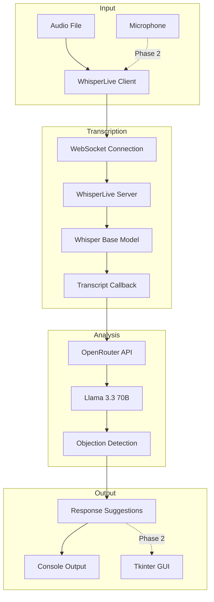
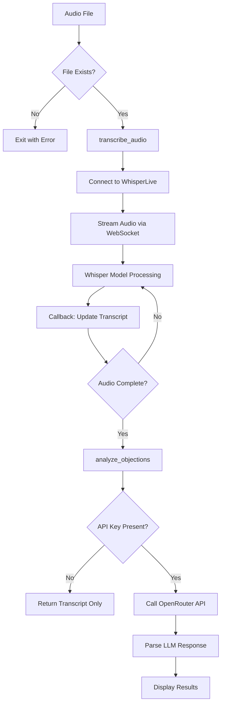
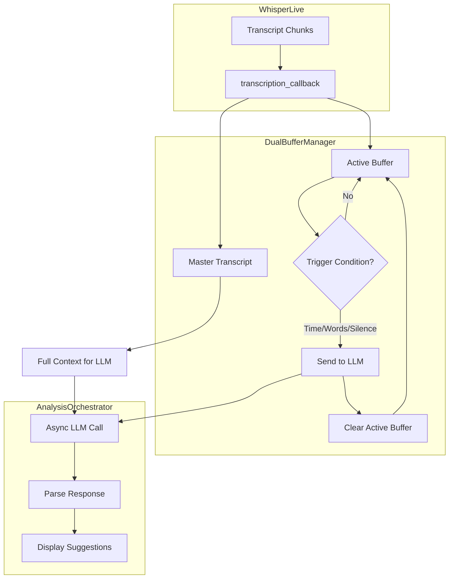

# Sales AI - Real-Time Sales Objection Detection

AI-powered system that listens to sales conversations, detects objections, and suggests responses in real-time.

**Status:** Phase 1 (Proof of Concept) complete. Core value proposition validated.

## Architecture


## Quick Start

### Prerequisites

- Python 3.10+
- WhisperLive Docker server running on port 9090
- OpenRouter API key (free at https://openrouter.ai)

### Setup
```bash
# 1. Install dependencies (~3GB download)
uv sync

# 2. Configure API key
echo 'OPENROUTER_API_KEY=sk-or-v1-your-key-here' > .env

# 3. Start WhisperLive server (if not running)
docker run -it --gpus all -p 9090:9090 ghcr.io/collabora/whisperlive-gpu:latest

# 4. Run
uv run python src/transcribe_and_analyze.py test.mp4
```

## Usage
```bash
# Transcribe and analyze any audio file
uv run python src/transcribe_and_analyze.py path/to/audio.mp4

# Test objection detection with mock data
uv run python test_objection_detection.py

# Press Ctrl+C during transcription to analyze partial transcript
```

## Features

### Objection Detection

Detects 4 objection types:

| Type | Description |
|------|-------------|
| PRICE | Cost, budget, expense concerns |
| TIME | Not ready, need to think, timing issues |
| DECISION_MAKER | Need to consult spouse/partner/boss |
| OTHER | Any other objections |

### Analysis Output

For each objection:

- Type classification
- Confidence level (HIGH/MEDIUM/LOW)
- Smokescreen detection (genuine vs. hiding concerns)
- 3 suggested responses

### Example Output
```
OBJECTION #1:
Type: PRICE
Confidence: HIGH
Smokescreen: MAYBE
Quote: "That sounds expensive"

Suggested Responses:
1. "I understand budget is a concern. Let me show you the ROI..."
2. "What specific aspect of the pricing concerns you most?"
3. "Many clients initially felt the same way, but found..."
```

## Project Structure
```
sales-rpg-ai/
├── src/
│   ├── transcribe_and_analyze.py  # Main pipeline
│   └── realtime/                   # Real-time analysis (Phase 2)
│       ├── buffer_manager.py       # Dual buffer for streaming
│       └── analysis_orchestrator.py # Async LLM calls
├── test_objection_detection.py     # Test suite
├── docs/
│   ├── mvp.md                      # Phase roadmap
│   └── product/                    # PRDs and PM docs
├── WhisperLive/                    # Transcription submodule
├── pyproject.toml                  # Dependencies
└── .env                            # API keys
```

## Data Flow


## Technology Stack

| Component | Technology |
|-----------|------------|
| Language | Python 3.10+ |
| Transcription | WhisperLive (WebSocket, Whisper base model) |
| Analysis | OpenRouter API (Llama 3.3 70B, free tier) |
| Audio Formats | MP4, MP3, WAV, M4A, FLAC (via FFmpeg) |
| Package Manager | UV |

## Troubleshooting

| Problem | Solution |
|---------|----------|
| "No module named 'openai'" | Use `uv run python ...` or activate venv first |
| "Audio file not found" | Check file path (relative or absolute) |
| "No transcript generated" | Check WhisperLive server: `docker ps \| grep 9090` |
| "No OpenRouter API key found" | Add to `.env` or `export OPENROUTER_API_KEY` |

## Roadmap

### Phase 1: Proof of Concept ✅ Complete

- [x] Audio transcription (WhisperLive)
- [x] Objection detection (4 types)
- [x] Response suggestions (3 per objection)
- [x] Confidence scoring
- [x] Test suite

### Phase 2: Real-Time MVP 🔄 In Progress

- [x] Live transcript streaming (WhisperLive callback working)
- [x] Architecture design (dual buffer PRD complete)
- [ ] DualBufferManager implementation
- [ ] AnalysisOrchestrator implementation
- [ ] Chunked analysis (<3s latency)
- [ ] Real-time microphone input
- [ ] Tkinter desktop GUI

### Phase 3: Production (Future)

- [ ] Invisible overlay UI
- [ ] Ultra-low latency (<150ms)
- [ ] Custom response training
- [ ] Cloud deployment

See `docs/mvp.md` for detailed phase specifications.

## Development

### Whisper Model Options

| Model | Size | Speed | Accuracy |
|-------|------|-------|----------|
| tiny | ~39MB | Very Fast | Lower |
| base | ~74MB | Fast | Good |
| small | ~244MB | Medium | Better |
| medium | ~769MB | Slow | Great |
| large | ~1.5GB | Very Slow | Best |

Default is `base` for balance of speed and accuracy.

### Configuration
```python
# WhisperLive
host = "localhost"
port = 9090
model = "base"

# OpenRouter
base_url = "https://openrouter.ai/api/v1"
model = "meta-llama/llama-3.3-70b-instruct:free"
```

## Dual Buffer Architecture (Phase 2)


### Trigger Conditions

| Condition | Default | Rationale |
|-----------|---------|-----------|
| Time elapsed | 3 seconds | Ensures responsiveness |
| Completed segments | 2 segments | Natural speech boundaries |
| Character count | 150 chars | Handles fast speech |
| Sentence ending | `. ? !` | Natural analysis points |
| Silence detected | 1.5 seconds | Speaker pauses |

## License

MIT