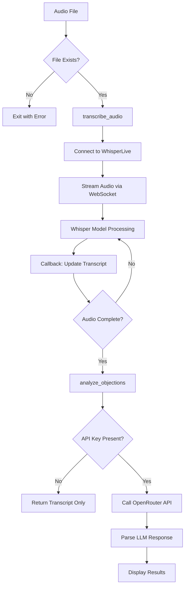
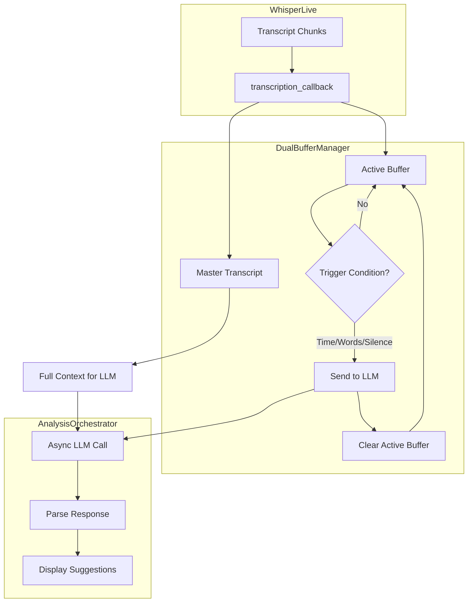

# Sales AI - Real-Time Sales Objection Detection

AI-powered system that listens to sales conversations, detects objections, and suggests responses in real-time.

**Status:** Phase 2 (Real-Time MVP) complete. [View Detailed Status & Roadmap](docs/mvp.md).

## Architecture

```mermaid
graph TB
    subgraph Frontend
        Browser[Web Browser (AudioWorklet)]
    end

    subgraph Backend
        FastAPI[FastAPI Server]
        Buffer[DualBufferManager]
    end

    subgraph Services
        Whisper[WhisperLive (Docker)]
        LocalAI[LocalAI (Phi-3.5-mini)]
    end

    Browser -- Audio Stream (WS) --> FastAPI
    FastAPI -- Forward Audio --> Whisper
    Whisper -- Transcript --> FastAPI
    FastAPI -- Text --> Buffer
    Buffer -- Trigger Analysis --> LocalAI
    LocalAI -- JSON Response --> FastAPI
    FastAPI -- Objection Event (WS) --> Browser
```

## Quick Start (Docker)

The easiest way to run the application is using Docker. This sets up both the WhisperLive server and the Web UI.

### Prerequisites
- Docker & Docker Compose
- NVIDIA GPU (Optional, but recommended for speed)
- OpenRouter API Key

### Setup

1. **Clone and Configure**
   ```bash
   git clone <repo>
   cd sales-rpg-ai
   echo "OPENROUTER_API_KEY=sk-or-v1-your-key-here" > .env
   ```

2. **Run**
   ```bash
   make up
   ```
   *This will automatically detect if you have an NVIDIA GPU and configure the containers accordingly.*

3. **Use**
   Open **http://localhost:8080** in your browser.

---

## Manual Setup (Dev)

### Prerequisites

- Python 3.10+
- WhisperLive Docker server running on port 9090
- OpenRouter API key (free at https://openrouter.ai)

### Setup
```bash
# 1. Install dependencies
pip install -e .
pip install python-dotenv websockets uvicorn

# 2. Configure API key
echo 'OPENROUTER_API_KEY=sk-or-v1-your-key-here' > .env

# 3. Start WhisperLive server (if not running)
# CPU
docker run -it -p 9090:9090 ghcr.io/collabora/whisperlive-cpu:latest
# GPU
docker run -it --gpus all -p 9090:9090 ghcr.io/collabora/whisperlive-gpu:latest

# 4. Run Web UI
python src/web/run.py
```

## CLI Usage (Legacy)
```bash
# Real-time analysis (streaming, with WhisperLive)
python src/realtime_transcribe.py path/to/audio.mp4

# Real-time with verbose output (shows all LLM responses)
uv run python src/realtime_transcribe.py path/to/audio.mp4 --verbose

# Microphone input (live)
uv run python src/realtime_transcribe.py --mic

# Test real-time flow without WhisperLive
uv run python src/test_realtime_flow.py

# Batch analysis (original Phase 1 script)
uv run python src/transcribe_and_analyze.py path/to/audio.mp4

# Test objection detection with mock data
uv run python test_objection_detection.py
```

## Features

### Objection Detection

Detects 4 objection types:

| Type | Description |
|------|-------------|
| PRICE | Cost, budget, expense concerns |
| TIME | Not ready, need to think, timing issues |
| DECISION_MAKER | Need to consult spouse/partner/boss |
| OTHER | Any other objections |

### Analysis Output

For each objection:

- Type classification
- Confidence level (HIGH/MEDIUM/LOW)
- Smokescreen detection (genuine vs. hiding concerns)
- 3 suggested responses

### Example Output
```
OBJECTION #1:
Type: PRICE
Confidence: HIGH
Smokescreen: MAYBE
Quote: "That sounds expensive"

Suggested Responses:
1. "I understand budget is a concern. Let me show you the ROI..."
2. "What specific aspect of the pricing concerns you most?"
3. "Many clients initially felt the same way, but found..."
```

## Project Structure
```
sales-rpg-ai/
├── src/
│   ├── transcribe_and_analyze.py   # Batch analysis (Phase 1)
│   ├── realtime_transcribe.py      # Real-time analysis (Phase 2)
│   ├── test_realtime_flow.py       # Test without WhisperLive
│   └── realtime/                   # Real-time module
│       ├── __init__.py             # Module exports
│       ├── buffer_manager.py       # DualBufferManager, BufferConfig
│       └── analysis_orchestrator.py # AnalysisOrchestrator, StreamingAnalyzer
├── test_objection_detection.py     # Mock data test suite
├── docs/
│   ├── mvp.md                      # Phase roadmap
│   └── product/                    # PRDs and PM docs
├── WhisperLive/                    # Transcription submodule
├── pyproject.toml                  # Dependencies
├── CHANGELOG.md                    # Development history
└── .env                            # API keys
```

## Data Flow


## Technology Stack

| Component | Technology |
|-----------|------------|
| Language | Python 3.10+ |
| Transcription | WhisperLive (WebSocket, Whisper base model) |
| Analysis | OpenRouter API (Llama 3.3 70B, free tier) |
| Audio Formats | MP4, MP3, WAV, M4A, FLAC (via FFmpeg) |
| Package Manager | UV |

## Troubleshooting

| Problem | Solution |
|---------|----------|
| "No module named 'openai'" | Use `uv run python ...` or activate venv first |
| "Audio file not found" | Check file path (relative or absolute) |
| "No transcript generated" | Check WhisperLive server: `docker ps \| grep 9090` |
| "No OpenRouter API key found" | Add to `.env` or `export OPENROUTER_API_KEY` |

## Roadmap

### Phase 1: Proof of Concept ✅ Complete

- [x] Audio transcription (WhisperLive)
- [x] Objection detection (4 types)
- [x] Response suggestions (3 per objection)
- [x] Confidence scoring
- [x] Test suite

### Phase 2: Real-Time MVP ✅ Complete

- [x] Live transcript streaming (WhisperLive callback)
- [x] Architecture design (dual buffer PRD)
- [x] DualBufferManager implementation
- [x] AnalysisOrchestrator implementation
- [x] Chunked analysis (~1-3s latency)
- [x] Integration script (realtime_transcribe.py)
- [x] Verbose mode for debugging
- [x] Test script without WhisperLive
- [x] Web UI (FastAPI + WebSocket)
- [x] Docker Deployment (CPU/GPU auto-detect)
- [x] "Gatekeeper" Rate Limiting (Cost Optimization)
- [x] **LocalAI Integration**: Replaced OpenRouter with local LLM (Phi-3.5-mini) running in Docker.

### Phase 3: Context & Intelligence (Next)

- [ ] **Conversation State Manager**: Track sales phases (Intro, Discovery, Closing).
- [ ] **Invisible Overlay UI**: Desktop widget that floats over Zoom/Teams.
- [ ] **Ultra-low latency**: Optimize local networking for <150ms response.
- [ ] **Enterprise Deployment**: Self-hosted container stack (WhisperLive + LocalAI + App).

## Deployment Strategy

The application supports two deployment modes to fit different business models:

### 1. SaaS / Pro Tier (Cloud)
- **Transcription**: Hosted WhisperLive (or local).
- **Intelligence**: OpenRouter API (Llama 3.3 70B).
- **Cost Control**: Uses "Gatekeeper" logic to only analyze text containing objection keywords.
- **Pros**: No high-end hardware required for the user.

### 2. Local / Privacy Tier (Current Default)
- **Transcription**: Local WhisperLive (GPU).
- **Intelligence**: LocalAI (Phi-3.5-mini).
- **Pros**: 100% Private, Free (no API costs), Offline capable.
- **Requirements**: NVIDIA GPU (4GB+ VRAM recommended).
- **Intelligence**: **LocalAI** running a quantized model (e.g., Mistral 7B) inside the Docker network.
- **Privacy**: 100% local processing. No audio or text leaves the machine.
- **Pros**: Unlimited analysis, zero latency, total privacy.

## Development

### Whisper Model Options

| Model | Size | Speed | Accuracy |
|-------|------|-------|----------|
| tiny | ~39MB | Very Fast | Lower |
| base | ~74MB | Fast | Good |
| small | ~244MB | Medium | Better |
| medium | ~769MB | Slow | Great |
| large | ~1.5GB | Very Slow | Best |

Default is `base` for balance of speed and accuracy.

### Configuration
```python
# WhisperLive
host = "localhost"
port = 9090
model = "base"

# OpenRouter
base_url = "https://openrouter.ai/api/v1"
model = "meta-llama/llama-3.3-70b-instruct:free"
```

## Dual Buffer Architecture (Phase 2)


### Trigger Conditions

| Condition | Default | Rationale |
|-----------|---------|-----------|
| Time elapsed | 3 seconds | Ensures responsiveness |
| Completed segments | 2 segments | Natural speech boundaries |
| Character count | 150 chars | Handles fast speech |
| Sentence ending | `. ? !` | Natural analysis points |
| Silence detected | 1.5 seconds | Speaker pauses |

## License

MIT

