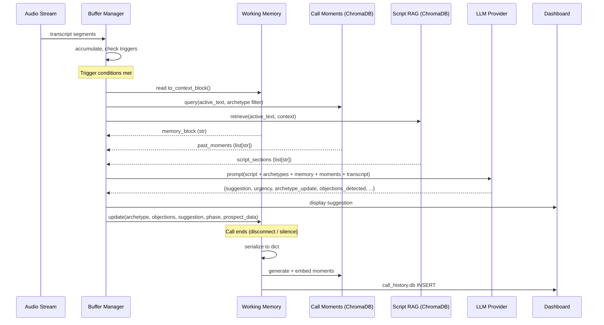

# Two-Tier Memory Architecture for Sales RPG AI

**Status:** Spec Complete -- Ready for Implementation
**Date:** 2026-02-18
**Author:** Architecture Agent
**Depends on:** Phase 4 MVP (stateless inference), Phase 5 RAG pipeline (ChromaDB + sentence-transformers)

---

## 1. Problem Statement

The current inference cycle is stateless. Each cycle receives a transcript chunk, the sales script (or RAG-retrieved sections), and buyer archetypes -- then produces a suggestion with no memory of prior cycles. This causes three concrete problems:

1. **Repeated suggestions.** The LLM suggests the same question or talking point it already suggested 2 minutes ago because it has no record of what it already said.
2. **Lost context accumulation.** Objections, archetype signals, and prospect data points discovered early in the call are unavailable to later inference cycles unless they happen to fall within the 30-second context buffer window.
3. **No cross-call learning.** The system cannot say "Last time a vision_buyer raised a spouse objection at the close, the rep who used X approach closed" because no call history exists.

---

## 2. Architecture Overview

```
                         LIVE CALL
                            |
                            v
    +---------------------------------------------------+
    |              TIER 1: Working Memory                |
    |         (in-process Python object, per-call)       |
    |                                                    |
    |  call_id, archetype tracking, objections,          |
    |  suggestions delivered, prospect data,             |
    |  script phase, urgency events                      |
    +---------------------------------------------------+
            |                               |
            | read each cycle               | flush on call end
            v                               v
    +------------------+          +---------------------+
    | Inference Cycle  |          | TIER 2: Call Store   |
    | (LLM request)    |<---------| (SQLite + ChromaDB) |
    +------------------+  RAG     +---------------------+
                          query        ^
                                       |
                                  30 seed transcripts
                                  (transcript_analysis.json)
```

---

## 3. Technology Stack Decisions

| Component | Choice | Rationale |
|-----------|--------|-----------|
| Tier 1 storage | Python dataclass (in-process) | Zero latency. Lives in the same process as the inference loop. No serialization needed. Destroyed on call end. |
| Tier 2 structured data | SQLite (file: `data/call_history.db`) | Already local, zero-config, works in Docker via volume mount. 30 calls now, maybe 500 in a year -- SQLite handles millions. No Postgres overhead for MVP. |
| Tier 2 embeddings | ChromaDB (existing `data/chromadb/`) | Already in the stack for script RAG. Adding a second collection (`call_moments`) reuses the same infrastructure and embedding model (`all-MiniLM-L6-v2`). |
| Embedding model | `all-MiniLM-L6-v2` (384 dims) | Already loaded in `EmbeddingStore`. 80ms encode time on CPU. Adding call moment embeddings costs nothing extra. |
| Call-end detection | Silence timeout + WebSocket disconnect | Two signals: (a) WebSocket close event already handled in `app.py`, (b) VAD silence > 30s as secondary signal. |

**What we are NOT adding:** No Postgres, no Redis, no external vector DB, no separate embedding service. Everything runs in-process or in the existing Docker volume.

---

## 4. Tier 1: Working Memory Schema

This object is instantiated when a call begins and lives in Python memory for the duration of the call. Every inference cycle reads it and writes back updates. When the call ends, it is serialized to Tier 2 and then discarded.

```python
from __future__ import annotations
from dataclasses import dataclass, field
from datetime import datetime
from enum import Enum
from typing import Optional
import uuid


class Urgency(str, Enum):
    NORMAL = "normal"
    CRITICAL = "critical"


@dataclass
class ArchetypeSignal:
    """A single piece of evidence for/against an archetype."""
    timestamp: float              # seconds into call
    archetype: str                # e.g. "pain_buyer", "vision_buyer"
    signal: str                   # what was said/detected
    confidence_delta: float       # how much this moved confidence (+/-)
    transcript_excerpt: str       # the actual words (max 200 chars)


@dataclass
class Objection:
    """An objection raised by the prospect."""
    timestamp: float
    category: str                 # "money", "spouse", "think_about_it", "time", "value", "other"
    verbatim: str                 # prospect's actual words (max 300 chars)
    handled: bool = False
    handling_approach: Optional[str] = None  # what the rep said in response


@dataclass
class DeliveredSuggestion:
    """A suggestion the system already sent to the rep."""
    timestamp: float
    suggestion_text: str
    script_phase: str
    urgency: Urgency
    fingerprint: str              # lowercase, stripped -- for dedup comparison


@dataclass
class UrgencyEvent:
    """A moment where urgency shifted to critical."""
    timestamp: float
    trigger: str                  # e.g. "deposit_push_moment", "buying_signal", "objection_escalation"
    context: str                  # what happened


@dataclass
class ProspectData:
    """Extracted prospect information, updated progressively."""
    name: Optional[str] = None
    current_role: Optional[str] = None
    employment_status: Optional[str] = None   # "employed", "unemployed", "freelance"
    pain_statements: list[str] = field(default_factory=list)
    goal_statements: list[str] = field(default_factory=list)
    timeline: Optional[str] = None            # "3-6 months", "immediately", etc.
    salary_target: Optional[str] = None
    family_situation: Optional[str] = None    # "spouse involved", "solo decision"
    technical_baseline: dict[str, int] = field(default_factory=dict)  # {"linux": 3, "containers": 5, ...}
    temp_check_score: Optional[int] = None
    now_commitment: Optional[bool] = None     # did they say "yes" to the NOW tie-down?
    budget_signals: list[str] = field(default_factory=list)


@dataclass
class WorkingMemory:
    """
    Complete in-call state. One instance per live call.

    Created at call start. Updated every inference cycle.
    Flushed to Tier 2 at call end. Then garbage collected.
    """
    # Identity
    call_id: str = field(default_factory=lambda: str(uuid.uuid4()))
    start_time: datetime = field(default_factory=datetime.utcnow)

    # Archetype tracking (updates each cycle)
    detected_archetype: str = "unknown"        # current best guess
    archetype_confidence: float = 0.0          # 0.0 to 1.0
    archetype_signals: list[ArchetypeSignal] = field(default_factory=list)

    # Objections (grows during call)
    objections: list[Objection] = field(default_factory=list)

    # Dedup: suggestions already sent
    delivered_suggestions: list[DeliveredSuggestion] = field(default_factory=list)

    # Script progression
    current_phase: str = "Open"                # matches kubecraft_script.md PART names
    phases_completed: list[str] = field(default_factory=list)
    phase_transitions: list[tuple[float, str, str]] = field(default_factory=list)  # (timestamp, from, to)

    # Prospect intel
    prospect: ProspectData = field(default_factory=ProspectData)

    # Urgency tracking
    urgency_events: list[UrgencyEvent] = field(default_factory=list)
    current_urgency: Urgency = Urgency.NORMAL

    # Running transcript (for post-call flush -- NOT sent to LLM each cycle)
    full_transcript_lines: list[str] = field(default_factory=list)

    # Cycle counter
    inference_cycle_count: int = 0
    last_cycle_timestamp: float = 0.0

    # --- Methods ---

    def has_suggestion_been_delivered(self, suggestion: str) -> bool:
        """Check if a suggestion (or close variant) was already delivered."""
        fp = self._fingerprint(suggestion)
        return any(d.fingerprint == fp for d in self.delivered_suggestions)

    def record_suggestion(self, suggestion: str, phase: str, urgency: Urgency) -> None:
        """Record a suggestion as delivered."""
        import time
        self.delivered_suggestions.append(DeliveredSuggestion(
            timestamp=time.time(),
            suggestion_text=suggestion,
            script_phase=phase,
            urgency=urgency,
            fingerprint=self._fingerprint(suggestion),
        ))

    def get_objection_categories(self) -> list[str]:
        """Get list of objection categories raised so far."""
        return list(set(o.category for o in self.objections))

    def to_context_block(self) -> str:
        """
        Serialize to a compact text block for LLM context injection.

        This is what gets injected into the prompt each cycle. Must be
        concise -- target < 500 tokens.
        """
        lines = []
        lines.append(f"ARCHETYPE: {self.detected_archetype} (confidence: {self.archetype_confidence:.0%})")
        lines.append(f"SCRIPT PHASE: {self.current_phase}")

        if self.prospect.name:
            lines.append(f"PROSPECT: {self.prospect.name}")
        if self.prospect.pain_statements:
            lines.append(f"PAIN POINTS: {'; '.join(self.prospect.pain_statements[-3:])}")
        if self.prospect.goal_statements:
            lines.append(f"GOALS: {'; '.join(self.prospect.goal_statements[-2:])}")
        if self.prospect.temp_check_score is not None:
            lines.append(f"TEMP CHECK: {self.prospect.temp_check_score}/10")
        if self.prospect.now_commitment is not None:
            lines.append(f"NOW COMMITMENT: {'Yes' if self.prospect.now_commitment else 'No'}")

        if self.objections:
            obj_summary = "; ".join(f"{o.category}: \"{o.verbatim[:60]}\"" for o in self.objections[-3:])
            lines.append(f"OBJECTIONS RAISED: {obj_summary}")

        if self.delivered_suggestions:
            recent = self.delivered_suggestions[-5:]
            lines.append(f"ALREADY SUGGESTED ({len(self.delivered_suggestions)} total): " +
                         "; ".join(f"\"{s.suggestion_text[:50]}\"" for s in recent))

        if self.urgency_events:
            lines.append(f"URGENCY EVENTS: {'; '.join(e.trigger for e in self.urgency_events[-3:])}")

        return "\n".join(lines)

    @staticmethod
    def _fingerprint(text: str) -> str:
        """Create a normalized fingerprint for dedup comparison."""
        import re
        return re.sub(r'\s+', ' ', text.lower().strip())
```

### Size Budget

The `to_context_block()` output targets **< 500 tokens** (~375 words). This is the only part of working memory that enters the LLM context window. The full object (transcript lines, signal history) stays in Python memory for the post-call flush but never enters the prompt.

---

## 5. Tier 2: Long-Term Call Store

### 5.1 SQLite Schema (Structured Data)

File location: `data/call_history.db`

```sql
-- Core call record. One row per completed call.
CREATE TABLE IF NOT EXISTS calls (
    call_id         TEXT PRIMARY KEY,
    start_time      TEXT NOT NULL,           -- ISO 8601
    end_time        TEXT,
    duration_seconds REAL,

    -- Outcome
    outcome         TEXT DEFAULT 'unknown',  -- 'close', 'loss', 'unknown', 'follow_up'
    outcome_source  TEXT DEFAULT 'manual',   -- 'manual', 'inferred', 'labeled'
    revenue         REAL,

    -- Archetype
    archetype       TEXT,                    -- 'pain_buyer', 'vision_buyer', etc.
    archetype_confidence REAL,

    -- Prospect
    prospect_name   TEXT,
    prospect_role   TEXT,
    employment_status TEXT,
    salary_target   TEXT,
    timeline        TEXT,
    temp_check_score INTEGER,
    now_commitment  INTEGER,                 -- 0 or 1

    -- Script
    phases_completed TEXT,                   -- JSON array: ["Open", "Set Agenda", ...]
    final_phase     TEXT,

    -- Duration category
    duration_category TEXT,                  -- 'short', 'medium', 'long'

    -- Notes
    notes           TEXT,
    loss_reason     TEXT,
    close_trigger   TEXT,
    key_turning_point TEXT,

    -- Full transcript (compressed)
    full_transcript TEXT,                    -- complete call transcript

    -- Metadata
    created_at      TEXT DEFAULT (datetime('now')),
    source          TEXT DEFAULT 'live'      -- 'live' or 'seed' (from transcript_analysis.json)
);

-- Objections raised during the call
CREATE TABLE IF NOT EXISTS call_objections (
    id              INTEGER PRIMARY KEY AUTOINCREMENT,
    call_id         TEXT NOT NULL REFERENCES calls(call_id),
    timestamp_sec   REAL,
    category        TEXT NOT NULL,           -- 'money', 'spouse', 'think_about_it', etc.
    verbatim        TEXT,
    handled         INTEGER DEFAULT 0,
    handling_approach TEXT
);

-- Pain statements, goal statements, and key quotes
CREATE TABLE IF NOT EXISTS call_quotes (
    id              INTEGER PRIMARY KEY AUTOINCREMENT,
    call_id         TEXT NOT NULL REFERENCES calls(call_id),
    quote_type      TEXT NOT NULL,           -- 'pain', 'goal', 'budget', 'objection_verbatim'
    content         TEXT NOT NULL,
    timestamp_sec   REAL
);

-- Archetype signals observed during the call
CREATE TABLE IF NOT EXISTS archetype_signals (
    id              INTEGER PRIMARY KEY AUTOINCREMENT,
    call_id         TEXT NOT NULL REFERENCES calls(call_id),
    archetype       TEXT NOT NULL,
    signal          TEXT NOT NULL,
    confidence_delta REAL,
    timestamp_sec   REAL
);

-- Suggestions delivered during the call (for analysis)
CREATE TABLE IF NOT EXISTS delivered_suggestions (
    id              INTEGER PRIMARY KEY AUTOINCREMENT,
    call_id         TEXT NOT NULL REFERENCES calls(call_id),
    suggestion_text TEXT NOT NULL,
    script_phase    TEXT,
    urgency         TEXT,
    timestamp_sec   REAL
);

-- Indexes for common queries
CREATE INDEX IF NOT EXISTS idx_calls_archetype ON calls(archetype);
CREATE INDEX IF NOT EXISTS idx_calls_outcome ON calls(outcome);
CREATE INDEX IF NOT EXISTS idx_calls_start_time ON calls(start_time);
CREATE INDEX IF NOT EXISTS idx_objections_category ON call_objections(category);
CREATE INDEX IF NOT EXISTS idx_objections_call_id ON call_objections(call_id);
CREATE INDEX IF NOT EXISTS idx_quotes_call_id ON call_quotes(call_id);
CREATE INDEX IF NOT EXISTS idx_quotes_type ON call_quotes(quote_type);
```

### 5.2 ChromaDB Collection (Semantic Embeddings)

A **second collection** in the existing ChromaDB store at `data/chromadb/`. The existing `sales_script` collection is untouched.

**Collection name:** `call_moments`

**What gets embedded:** "Moments" -- each is a chunk of a past call that captures a specific interaction pattern:

```python
# Structure of a call moment document stored in ChromaDB
{
    "id": "{call_id}__moment_{n}",        # e.g. "abc123__moment_3"
    "text": (                              # The embedded text (what similarity search runs against)
        "Prospect (vision_buyer) said: 'I need to talk to my wife about this first.' "
        "Objection category: spouse. "
        "Rep responded by asking about the wife's feelings on career change. "
        "Outcome: handled, call continued to close."
    ),
    "metadata": {
        "call_id": "abc123",
        "archetype": "vision_buyer",
        "outcome": "close",
        "objection_category": "spouse",       # or None if not an objection moment
        "script_phase": "Close",
        "moment_type": "objection_handling",  # "objection_handling", "discovery_insight",
                                              # "closing_technique", "pain_excavation",
                                              # "buying_signal"
        "prospect_verbatim": "I need to talk to my wife about this first.",
        "rep_response_summary": "Asked how wife feels about career change.",
        "timestamp_sec": 1842.5,
    }
}
```

**Embedding model:** Same `all-MiniLM-L6-v2` via the existing `EmbeddingStore` class. No new dependencies.

### 5.3 Seeding from Existing Transcripts

The 30 calls in `knowledge_base/transcript_analysis.json` are the seed data. They do not have full transcripts (only structured analysis), so we seed them as **structured records + synthetic moments**.

```python
"""
Seed script: data/seed_call_history.py

Run once: python -m data.seed_call_history
Idempotent: checks call_id before inserting.
"""

import json
import sqlite3
import hashlib
from pathlib import Path

ANALYSIS_PATH = Path("knowledge_base/transcript_analysis.json")
DB_PATH = Path("data/call_history.db")


def seed():
    data = json.loads(ANALYSIS_PATH.read_text())
    conn = sqlite3.connect(DB_PATH)
    conn.execute("PRAGMA journal_mode=WAL")

    for call in data["calls"]:
        # Deterministic call_id from prospect name + date
        call_id = hashlib.sha256(
            f"{call['prospect_name']}_{call['date']}".encode()
        ).hexdigest()[:16]

        # Skip if already seeded
        existing = conn.execute(
            "SELECT 1 FROM calls WHERE call_id = ?", (call_id,)
        ).fetchone()
        if existing:
            continue

        # Map duration estimate to category
        dur = call.get("call_duration_estimate", "")
        if "short" in dur:
            duration_cat = "short"
        elif "long" in dur:
            duration_cat = "long"
        else:
            duration_cat = "medium"

        # Insert call record
        conn.execute("""
            INSERT INTO calls (
                call_id, start_time, outcome, outcome_source, revenue,
                archetype, archetype_confidence, prospect_name,
                phases_completed, duration_category,
                notes, loss_reason, close_trigger, key_turning_point, source
            ) VALUES (?, ?, ?, 'labeled', ?, ?, ?, ?, ?, ?, ?, ?, ?, ?, 'seed')
        """, (
            call_id,
            call["date"],
            call["outcome"],
            call.get("revenue"),
            call["buyer_archetype"],
            {"high": 0.9, "medium": 0.7, "low": 0.4}.get(
                call.get("archetype_confidence", "medium"), 0.5
            ),
            call["prospect_name"],
            json.dumps(call.get("script_phases_completed", [])),
            duration_cat,
            call.get("notes"),
            call.get("loss_reason"),
            call.get("close_trigger"),
            call.get("key_turning_point"),
        ))

        # Insert objections
        for obj_text in call.get("objections_raised", []):
            category = _classify_objection(obj_text)
            conn.execute("""
                INSERT INTO call_objections (call_id, category, verbatim)
                VALUES (?, ?, ?)
            """, (call_id, category, obj_text))

        # Insert archetype signals
        for signal in call.get("archetype_signals", []):
            conn.execute("""
                INSERT INTO archetype_signals (call_id, archetype, signal)
                VALUES (?, ?, ?)
            """, (call_id, call["buyer_archetype"], signal))

        # Insert pain/goal quotes from signals
        for signal in call.get("archetype_signals", []):
            quote_type = _classify_quote(signal, call["buyer_archetype"])
            if quote_type:
                conn.execute("""
                    INSERT INTO call_quotes (call_id, quote_type, content)
                    VALUES (?, ?, ?)
                """, (call_id, quote_type, signal))

    conn.commit()
    conn.close()


def _classify_objection(text: str) -> str:
    """Classify objection text into a category."""
    text_lower = text.lower()
    if any(w in text_lower for w in ["money", "expensive", "afford", "price", "payment", "budget", "cost"]):
        return "money"
    if any(w in text_lower for w in ["wife", "spouse", "husband", "partner", "discuss"]):
        return "spouse"
    if any(w in text_lower for w in ["think about", "consider", "decide", "need time"]):
        return "think_about_it"
    if any(w in text_lower for w in ["time", "busy", "schedule"]):
        return "time"
    if any(w in text_lower for w in ["same day", "same-day", "today"]):
        return "think_about_it"
    return "other"


def _classify_quote(signal: str, archetype: str) -> str | None:
    """Classify an archetype signal as a pain or goal quote."""
    signal_lower = signal.lower()
    pain_words = ["laid off", "unemployed", "struggling", "stuck", "frustrated",
                  "worried", "pressure", "failing", "behind"]
    goal_words = ["want to", "goal", "aiming", "looking to", "transition",
                  "advance", "grow", "level up", "career"]
    if any(w in signal_lower for w in pain_words):
        return "pain"
    if any(w in signal_lower for w in goal_words):
        return "goal"
    return None


if __name__ == "__main__":
    seed()
    print("Seed complete.")
```

**Seeding call moments into ChromaDB:**

After the SQLite seed, a second pass generates synthetic moment documents from the structured data and embeds them:

```python
def seed_moments_to_chromadb():
    """
    Generate call moment embeddings from seed data.

    Each call produces 1-4 moments based on available data:
    - Objection moments (one per objection)
    - Key turning point moment
    - Archetype detection moment
    """
    from src.rag.store import EmbeddingStore

    conn = sqlite3.connect(DB_PATH)
    store = EmbeddingStore(
        collection_name="call_moments",
        persist_dir="data/chromadb"
    )

    calls = conn.execute("SELECT * FROM calls WHERE source = 'seed'").fetchall()
    moments = []

    for call in calls:
        call_id = call[0]  # call_id column
        archetype = call[5]  # archetype column
        outcome = call[2]  # outcome column
        prospect = call[7]  # prospect_name column

        # Objection moments
        objections = conn.execute(
            "SELECT category, verbatim FROM call_objections WHERE call_id = ?",
            (call_id,)
        ).fetchall()

        for cat, verbatim in objections:
            moments.append({
                "id": f"{call_id}__obj_{cat}",
                "text": (
                    f"Prospect ({archetype}) raised objection: '{verbatim}'. "
                    f"Category: {cat}. Call outcome: {outcome}."
                ),
                "metadata": {
                    "call_id": call_id,
                    "archetype": archetype or "",
                    "outcome": outcome or "",
                    "objection_category": cat,
                    "moment_type": "objection_handling",
                    "prospect_verbatim": verbatim or "",
                }
            })

        # Key turning point moment
        turning_point = call[10]  # key_turning_point column
        if turning_point:
            moments.append({
                "id": f"{call_id}__turning",
                "text": (
                    f"Key turning point with {archetype}: {turning_point}. "
                    f"Outcome: {outcome}."
                ),
                "metadata": {
                    "call_id": call_id,
                    "archetype": archetype or "",
                    "outcome": outcome or "",
                    "moment_type": "turning_point",
                    "objection_category": "",
                }
            })

    store.add_chunks(moments)
    conn.close()
    return len(moments)
```

---

## 6. RAG Retrieval Strategy

### 6.1 What Gets Retrieved

At each inference cycle, we query the `call_moments` ChromaDB collection for past call moments similar to the **current transcript chunk**. The query is filtered by the current detected archetype when confidence is above 0.6.

### 6.2 Retrieval Pseudocode

```python
def retrieve_call_moments(
    active_text: str,
    working_memory: WorkingMemory,
    moment_store: EmbeddingStore,
    max_results: int = 2,
) -> list[str]:
    """
    Retrieve relevant past call moments for LLM context injection.

    Args:
        active_text: Current transcript chunk being analyzed.
        working_memory: Current call's working memory.
        moment_store: ChromaDB collection 'call_moments'.
        max_results: How many moments to inject (2 = sweet spot for latency).

    Returns:
        List of formatted moment strings ready for prompt injection.
    """
    # Build query: current text + recent objection context if any
    query = active_text.strip()
    if working_memory.objections:
        last_obj = working_memory.objections[-1]
        query += f" [objection: {last_obj.category} - {last_obj.verbatim[:80]}]"

    # Filter by archetype if confidence is high enough
    where_filter = None
    if working_memory.archetype_confidence >= 0.6:
        where_filter = {"archetype": working_memory.detected_archetype}

    # Query ChromaDB (< 20ms for 200 documents with all-MiniLM-L6-v2)
    results = moment_store.query(
        text=query,
        top_k=max_results + 1,  # fetch one extra to filter self
        where=where_filter,
    )

    # Filter out moments from the CURRENT call
    results = [r for r in results if r["metadata"]["call_id"] != working_memory.call_id]
    results = results[:max_results]

    # Format for prompt injection
    formatted = []
    for r in results:
        meta = r["metadata"]
        outcome_label = meta.get("outcome", "unknown")
        archetype = meta.get("archetype", "unknown")
        moment_type = meta.get("moment_type", "")

        if moment_type == "objection_handling":
            formatted.append(
                f"PAST CALL ({outcome_label}): {archetype} prospect raised "
                f"'{meta.get('objection_category', '')}' objection: "
                f"\"{meta.get('prospect_verbatim', '')[:100]}\""
            )
        elif moment_type == "turning_point":
            formatted.append(
                f"PAST CALL ({outcome_label}): Key moment with {archetype} -- "
                f"{r['text'][:150]}"
            )
        else:
            formatted.append(
                f"PAST CALL ({outcome_label}): {r['text'][:150]}"
            )

    return formatted
```

### 6.3 Latency Budget

| Operation | Target | Measured on similar workload |
|-----------|--------|------------------------------|
| ChromaDB query (200 docs, MiniLM) | < 25ms | ~15ms on CPU |
| Working memory `to_context_block()` | < 1ms | String concatenation |
| Total added to inference cycle | < 30ms | Well under 100ms target |

### 6.4 Context Window Impact

| Component | Token estimate |
|-----------|---------------|
| Working memory block | ~200-400 tokens |
| RAG call moments (2) | ~150-250 tokens |
| **Total added** | **~350-650 tokens** |
| Existing prompt (script sections + instructions) | ~1500-2500 tokens |
| **New total** | **~2000-3100 tokens** |

This is well within context limits for all configured providers (gpt-4o-mini: 128K, Gemini Flash: 1M, Llama 3.3 70B: 128K, even Phi-3.5: 128K).

---

## 7. Updated Inference Pipeline

### 7.1 ASCII Pipeline Diagram

```
BEFORE (Phase 4 -- stateless):

  transcript_chunk ──> LLM(script + archetypes) ──> {suggestion, urgency}
       ^                                                    |
       |                                                    v
  buffer_manager                                      display to rep


AFTER (Phase 6 -- memory-augmented):

  transcript_chunk
       |
       v
  ┌─────────────────────────────────────────────────────────────────┐
  │                    INFERENCE CYCLE                              │
  │                                                                 │
  │  1. Read working_memory.to_context_block()         [< 1ms]     │
  │  2. Retrieve call_moments from ChromaDB            [< 25ms]    │
  │  3. Build prompt:                                               │
  │     - system: script sections (RAG) + archetypes               │
  │     - user: transcript_chunk                                    │
  │            + WORKING MEMORY block                               │
  │            + PAST CALL MOMENTS block                            │
  │  4. LLM inference                                  [200-800ms] │
  │  5. Parse response: {suggestion, urgency, updates}              │
  │                                                                 │
  └──────────────────────────┬──────────────────────────────────────┘
                             │
                   ┌─────────┴─────────┐
                   │                   │
                   v                   v
            Display suggestion    Update working memory:
            to rep                 - archetype signals
                                   - new objections
                                   - prospect data
                                   - record suggestion
                                   - phase progression
```

### 7.2 Mermaid Diagram



### 7.3 Updated LLM Prompt Structure

The prompt changes are **additive** -- we inject two new blocks into the existing user message. The system prompt (script sections + archetype detection instructions) is unchanged.

```python
def build_memory_augmented_user_message(
    active_text: str,
    context_text: str,
    working_memory: WorkingMemory,
    past_moments: list[str],
) -> str:
    """
    Build the user message with memory context injected.

    Extends the existing message format from analysis_orchestrator.py
    with two new blocks: CALL STATE and SIMILAR PAST MOMENTS.
    """
    parts = []

    # Block 1: Working memory state (always present after first cycle)
    memory_block = working_memory.to_context_block()
    if memory_block.strip():
        parts.append(f"<call_state>\n{memory_block}\n</call_state>")

    # Block 2: Past call moments (0-2 items, may be empty early in call)
    if past_moments:
        moments_text = "\n".join(f"- {m}" for m in past_moments)
        parts.append(f"<similar_past_moments>\n{moments_text}\n</similar_past_moments>")

    # Block 3: Existing context + latest transcript (unchanged structure)
    if context_text:
        parts.append(f"<conversation_so_far>\n{context_text}\n</conversation_so_far>")

    parts.append(f"<latest>\n{active_text}\n</latest>")

    return "\n\n".join(parts)
```

### 7.4 Updated LLM Output Schema

The LLM response gains optional new fields for memory updates. The existing fields (`script_location`, `key_points`, `suggestion`) are unchanged.

```json
{
    "script_location": "Part 4: Pain/Problem",
    "key_points": ["prospect laid off 3 months ago", "wife is worried"],
    "suggestion": "Ask: 'How does your wife feel about you making this change?'",
    "urgency": "normal",

    "__memory_updates": {
        "archetype_signal": {
            "archetype": "pain_buyer",
            "signal": "Laid off, wife worried, financial pressure",
            "confidence_delta": 0.15
        },
        "objection_detected": null,
        "prospect_data": {
            "employment_status": "unemployed",
            "family_situation": "spouse involved"
        },
        "phase_update": "Pain"
    }
}
```

**Critical design choice:** The `__memory_updates` field is **optional and best-effort**. If the LLM does not return it (smaller models may not), the system still works -- working memory just updates less frequently. The `script_location`, `key_points`, and `suggestion` fields remain the contract. Memory updates can also be extracted deterministically from the transcript using keyword matching as a fallback path.

---

## 8. Post-Call Flush

### 8.1 Call End Detection

Two signals, combined with OR logic:

1. **WebSocket disconnect** (primary) -- Already handled in `app.py` lines 401-426. The `finally` block runs when the browser closes the connection or the user clicks stop. This is the reliable signal.

2. **Extended silence** (secondary) -- If the VAD detects > 60 seconds of silence, treat the call as potentially ended. Send a "call may have ended" message to the UI. If the user confirms (or another 60s passes), trigger flush.

```python
# In the WebSocket handler's finally block (app.py)
# AFTER summary_engine.stop() and BEFORE function return:

if working_memory and working_memory.inference_cycle_count > 0:
    await asyncio.to_thread(
        flush_working_memory_to_tier2,
        working_memory,
        outcome="unknown",  # default; UI can relabel later
    )
    logger.info(f"Call {working_memory.call_id} flushed to Tier 2 "
                f"({working_memory.inference_cycle_count} cycles, "
                f"{len(working_memory.objections)} objections)")
```

### 8.2 Flush Logic

```python
import sqlite3
import json
from datetime import datetime
from typing import Optional

from src.rag.store import EmbeddingStore


def flush_working_memory_to_tier2(
    wm: WorkingMemory,
    outcome: str = "unknown",
    revenue: Optional[float] = None,
    db_path: str = "data/call_history.db",
    chromadb_path: str = "data/chromadb",
) -> None:
    """
    Serialize working memory to Tier 2 storage.

    Called once when a call ends. Writes to both SQLite (structured)
    and ChromaDB (embeddings).

    Args:
        wm: The working memory from the just-ended call.
        outcome: Call outcome if known. Usually 'unknown' at flush time.
        revenue: Revenue amount if closed.
        db_path: Path to SQLite database.
        chromadb_path: Path to ChromaDB persist directory.
    """
    end_time = datetime.utcnow()
    duration = (end_time - wm.start_time).total_seconds()

    # --- SQLite: Structured data ---
    conn = sqlite3.connect(db_path)
    conn.execute("PRAGMA journal_mode=WAL")

    # Determine duration category
    if duration < 1800:
        dur_cat = "short"
    elif duration < 3000:
        dur_cat = "medium"
    else:
        dur_cat = "long"

    conn.execute("""
        INSERT OR REPLACE INTO calls (
            call_id, start_time, end_time, duration_seconds,
            outcome, outcome_source, revenue,
            archetype, archetype_confidence,
            prospect_name, prospect_role, employment_status,
            salary_target, timeline, temp_check_score, now_commitment,
            phases_completed, final_phase, duration_category,
            full_transcript, source
        ) VALUES (?, ?, ?, ?, ?, ?, ?, ?, ?, ?, ?, ?, ?, ?, ?, ?, ?, ?, ?, ?, 'live')
    """, (
        wm.call_id,
        wm.start_time.isoformat(),
        end_time.isoformat(),
        duration,
        outcome,
        "inferred" if outcome != "unknown" else "unknown",
        revenue,
        wm.detected_archetype,
        wm.archetype_confidence,
        wm.prospect.name,
        wm.prospect.current_role,
        wm.prospect.employment_status,
        wm.prospect.salary_target,
        wm.prospect.timeline,
        wm.prospect.temp_check_score,
        1 if wm.prospect.now_commitment else 0 if wm.prospect.now_commitment is not None else None,
        json.dumps(wm.phases_completed),
        wm.current_phase,
        dur_cat,
        "\n".join(wm.full_transcript_lines),
    ))

    # Objections
    for obj in wm.objections:
        conn.execute("""
            INSERT INTO call_objections (call_id, timestamp_sec, category, verbatim, handled, handling_approach)
            VALUES (?, ?, ?, ?, ?, ?)
        """, (wm.call_id, obj.timestamp, obj.category, obj.verbatim, 1 if obj.handled else 0, obj.handling_approach))

    # Quotes (pain + goal statements)
    for pain in wm.prospect.pain_statements:
        conn.execute(
            "INSERT INTO call_quotes (call_id, quote_type, content) VALUES (?, 'pain', ?)",
            (wm.call_id, pain)
        )
    for goal in wm.prospect.goal_statements:
        conn.execute(
            "INSERT INTO call_quotes (call_id, quote_type, content) VALUES (?, 'goal', ?)",
            (wm.call_id, goal)
        )

    # Archetype signals
    for sig in wm.archetype_signals:
        conn.execute("""
            INSERT INTO archetype_signals (call_id, archetype, signal, confidence_delta, timestamp_sec)
            VALUES (?, ?, ?, ?, ?)
        """, (wm.call_id, sig.archetype, sig.signal, sig.confidence_delta, sig.timestamp))

    # Delivered suggestions
    for sug in wm.delivered_suggestions:
        conn.execute("""
            INSERT INTO delivered_suggestions (call_id, suggestion_text, script_phase, urgency, timestamp_sec)
            VALUES (?, ?, ?, ?, ?)
        """, (wm.call_id, sug.suggestion_text, sug.script_phase, sug.urgency.value, sug.timestamp))

    conn.commit()
    conn.close()

    # --- ChromaDB: Embed call moments ---
    _generate_and_embed_moments(wm, outcome, chromadb_path)


def _generate_and_embed_moments(
    wm: WorkingMemory,
    outcome: str,
    chromadb_path: str,
) -> None:
    """
    Generate moment documents from working memory and embed them.

    Produces 1 moment per objection + 1 for the overall call pattern.
    """
    store = EmbeddingStore(
        collection_name="call_moments",
        persist_dir=chromadb_path,
    )

    moments = []

    # One moment per objection
    for i, obj in enumerate(wm.objections):
        handling_note = f"Rep responded: {obj.handling_approach}" if obj.handling_approach else "No handling recorded."
        moments.append({
            "id": f"{wm.call_id}__obj_{i}",
            "text": (
                f"Prospect ({wm.detected_archetype}) said: '{obj.verbatim[:200]}'. "
                f"Objection category: {obj.category}. "
                f"{handling_note} "
                f"Call outcome: {outcome}."
            ),
            "metadata": {
                "call_id": wm.call_id,
                "archetype": wm.detected_archetype or "",
                "outcome": outcome,
                "objection_category": obj.category,
                "moment_type": "objection_handling",
                "prospect_verbatim": obj.verbatim[:200],
                "script_phase": wm.current_phase or "",
            }
        })

    # One moment for the overall call pattern (if we have enough data)
    if wm.prospect.pain_statements or wm.prospect.goal_statements:
        pain_summary = "; ".join(wm.prospect.pain_statements[:3]) if wm.prospect.pain_statements else "none detected"
        goal_summary = "; ".join(wm.prospect.goal_statements[:2]) if wm.prospect.goal_statements else "none detected"
        moments.append({
            "id": f"{wm.call_id}__pattern",
            "text": (
                f"{wm.detected_archetype} prospect. "
                f"Pain: {pain_summary}. "
                f"Goals: {goal_summary}. "
                f"Phases completed: {', '.join(wm.phases_completed)}. "
                f"Objections: {', '.join(wm.get_objection_categories()) or 'none'}. "
                f"Outcome: {outcome}."
            ),
            "metadata": {
                "call_id": wm.call_id,
                "archetype": wm.detected_archetype or "",
                "outcome": outcome,
                "objection_category": "",
                "moment_type": "call_pattern",
                "prospect_verbatim": "",
                "script_phase": wm.current_phase or "",
            }
        })

    if moments:
        store.add_chunks(moments)
```

### 8.3 Outcome Labeling

Three paths, applied in priority order:

1. **Manual labeling (UI).** After a call ends, the dashboard shows an "Outcome?" prompt with buttons: Close / Loss / Follow-up / Unknown. This updates the `calls.outcome` column and re-embeds any affected moments with the correct outcome label.

2. **Inferred from closing language.** If the transcript contains buying signals near the end ("let's do it", "what's the next step", "I'm ready"), set outcome to `close` with `outcome_source = 'inferred'`. If it contains hard DQ language ("not interested", "not right now"), set to `loss`. Implemented as simple keyword matching on the last 20% of transcript lines.

3. **Default: unknown.** If neither manual nor inferred, outcome stays `unknown`. The system still stores the call and its moments -- they just have weaker outcome labels until manually corrected.

```python
def infer_outcome(transcript_lines: list[str]) -> tuple[str, str]:
    """
    Attempt to infer call outcome from closing language.

    Returns:
        (outcome, confidence): e.g. ("close", "high") or ("unknown", "none")
    """
    if not transcript_lines:
        return "unknown", "none"

    # Look at last 20% of transcript
    tail_start = max(0, len(transcript_lines) - len(transcript_lines) // 5)
    tail = " ".join(transcript_lines[tail_start:]).lower()

    close_signals = [
        "let's do it", "let's get started", "i'm ready", "i'm in",
        "take my payment", "where do i sign", "send me the link",
        "what's the next step", "okay let's go", "i want to enroll",
    ]
    loss_signals = [
        "not interested", "not right now", "i'll pass",
        "not for me", "can't do it", "no thank you",
    ]

    close_hits = sum(1 for s in close_signals if s in tail)
    loss_hits = sum(1 for s in loss_signals if s in tail)

    if close_hits >= 2:
        return "close", "high"
    if close_hits == 1:
        return "close", "medium"
    if loss_hits >= 1:
        return "loss", "medium"

    return "unknown", "none"
```

---

## 9. Integration Points (What Changes in Existing Code)

### 9.1 Files Modified

| File | Change | Risk |
|------|--------|------|
| `src/realtime/models.py` | Add `WorkingMemory` and related dataclasses | None -- additive, existing `ConversationState` untouched |
| `src/realtime/analysis_orchestrator.py` | `StreamingAnalyzer.analyze()` accepts optional `working_memory` and `past_moments` params; `AnalysisOrchestrator._worker_loop()` reads/writes working memory | Low -- existing signature still works without new params (backward compatible) |
| `src/realtime/prompts.py` | Add `build_memory_augmented_user_message()` function | None -- additive, existing prompt functions untouched |
| `src/rag/store.py` | No changes needed -- `EmbeddingStore` already supports multiple collections via `collection_name` param | None |
| `src/web/app.py` | Instantiate `WorkingMemory` at call start; pass to orchestrator; add flush in `finally` block | Medium -- this is the integration point. Must not break existing WebSocket flow. |
| `docker-compose.yml` | Add `./data:/app/data` volume mount (already present) | None |

### 9.2 Files Added

| File | Purpose |
|------|---------|
| `src/realtime/working_memory.py` | `WorkingMemory` dataclass and all supporting types |
| `src/realtime/memory_updater.py` | Logic to update working memory from LLM responses and transcript signals |
| `src/realtime/call_moment_retriever.py` | `retrieve_call_moments()` function |
| `src/realtime/post_call_flush.py` | `flush_working_memory_to_tier2()` and `infer_outcome()` |
| `data/seed_call_history.py` | One-time seed script for the 30 existing transcripts |
| `data/init_db.py` | SQLite schema creation (runs on first startup) |

### 9.3 Backward Compatibility

The memory system is **opt-in**. If `WorkingMemory` is not instantiated (e.g., in test mode or if initialization fails), the inference cycle falls back to the existing stateless behavior. The `analyze()` method signature uses default `None` for the new parameters:

```python
def analyze(
    self,
    active_text: str,
    context_text: str = "",
    working_memory: Optional[WorkingMemory] = None,
    past_moments: Optional[list[str]] = None,
) -> str:
    # If memory is available, use augmented prompt
    if working_memory:
        user_message = build_memory_augmented_user_message(
            active_text, context_text, working_memory, past_moments or []
        )
    else:
        # Existing behavior -- unchanged
        if context_text:
            user_message = f"<conversation_so_far>\n{context_text}\n</conversation_so_far>\n\n<latest>\n{active_text}\n</latest>"
        else:
            user_message = active_text
    # ... rest unchanged
```

---

## 10. Implementation Plan

### Phase 6A: Working Memory (In-Call State) -- 2-3 days

1. Create `src/realtime/working_memory.py` with all dataclasses
2. Create `src/realtime/memory_updater.py` -- deterministic extraction of archetype signals, objections, and prospect data from transcript text + LLM response
3. Modify `AnalysisOrchestrator._worker_loop()` to read/write working memory
4. Modify `src/web/app.py` to instantiate `WorkingMemory` at WebSocket connect
5. Add `to_context_block()` output to LLM prompt
6. Add suggestion dedup check before displaying

### Phase 6B: Tier 2 Storage -- 1-2 days

1. Create `data/init_db.py` with SQLite DDL
2. Create `data/seed_call_history.py`
3. Run seed script against the 30 existing transcripts
4. Seed ChromaDB `call_moments` collection
5. Add post-call flush in `app.py` `finally` block

### Phase 6C: RAG from Call History -- 1-2 days

1. Create `src/realtime/call_moment_retriever.py`
2. Wire `retrieve_call_moments()` into inference cycle
3. Add `<similar_past_moments>` block to prompt
4. Test latency impact (must stay under 100ms total addition)

### Phase 6D: Outcome Labeling -- 1 day

1. Add outcome inference from closing language
2. Add UI buttons for manual outcome labeling
3. Add outcome update API endpoint

**Total estimated effort: 5-8 days**

---

## 11. Testing Strategy

### Unit Tests

- `test_working_memory.py`: Verify `to_context_block()` output, suggestion dedup, objection tracking
- `test_memory_updater.py`: Verify deterministic extraction (given transcript text X, expect archetype signal Y)
- `test_post_call_flush.py`: Verify SQLite writes and ChromaDB moment generation
- `test_call_moment_retriever.py`: Verify retrieval with archetype filter, self-call exclusion

### Integration Tests

- Full cycle: start call -> 5 inference cycles -> end call -> verify Tier 2 records
- Seed verification: run seed script -> verify 30 calls in SQLite + moments in ChromaDB
- Latency test: measure inference cycle time with and without memory (delta < 30ms)
- Backward compatibility: run inference cycle with `working_memory=None` -> verify identical behavior to Phase 4

### Manual Testing

- Live call with memory enabled: verify no repeated suggestions, archetype tracks correctly
- Post-call: verify `call_history.db` contains the call, ChromaDB has moments
- Second call with same archetype: verify past moments appear in context

---

## 12. Risk Assessment

| Risk | Likelihood | Impact | Mitigation |
|------|------------|--------|------------|
| LLM ignores memory context | Medium | Low | Memory block uses clear XML tags. If LLM ignores it, system degrades gracefully to stateless behavior. |
| Memory block too large (token budget) | Low | Medium | Hard limit in `to_context_block()`: truncate to 500 tokens. Only include most recent N items. |
| ChromaDB query adds noticeable latency | Low | High | Measured at ~15ms for 200 docs. Even at 1000 docs, MiniLM stays under 50ms. If it grows past that, add archetype pre-filter. |
| Working memory state corruption (thread safety) | Medium | Medium | `WorkingMemory` is only written from the single `_worker_loop` thread. Reads from the same thread. No mutex needed. |
| SQLite concurrent writes | Low | Low | WAL mode + single-writer pattern. Only one call flushes at a time. |
| Seed data quality (no full transcripts) | Certain | Low | Seed moments are synthetic but still useful for archetype + objection pattern matching. Quality improves as live calls accumulate. |
