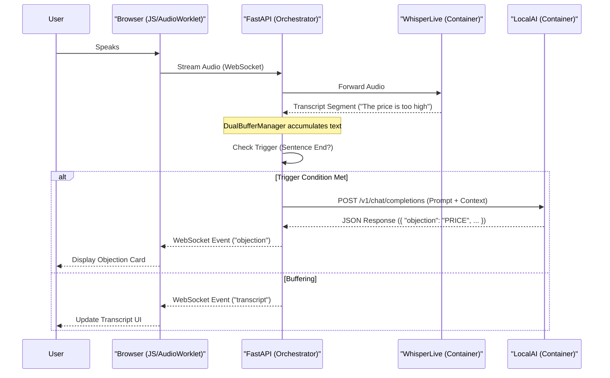

# Architecture Notes & Technical Decisions

**Date:** December 6, 2025

## 1. Dual Mode Inference (Cloud vs. Local)

We support two inference modes, toggled via `Makefile` commands:

### Cloud Mode (`make up-cloud`)
- **Provider**: OpenRouter (Llama 3.3 70B)
- **Latency**: ~3-5 seconds (UI response)
- **Pros**: Higher intelligence, no local hardware requirement.
- **Cons**: Cost per token, network dependency.

### Local Mode (`make up`)
- **Provider**: LocalAI (Phi-3.5 Mini)
- **Latency**: < 1 second (Round trip)
- **Pros**: Free, private, offline capable, extremely fast.
- **Cons**: Requires GPU (NVIDIA) for best performance, slightly less nuanced than 70B models.

## 2. Prompt Engineering Strategy

We implemented a **Dual Prompt Strategy** to handle the trade-off between local speed and cloud quality.

### The Challenge
- **LocalAI (Phi-3.5)**: Needs strict constraints to output valid JSON reliably. It struggles with complex instructions.
- **Cloud (Llama 3.3 70B)**: Performs better with nuanced, rich instructions but degraded when forced into the "dumb" strict JSON format we designed for the local model.

### The Solution: "Dual Prompts"
We created `src/realtime/prompts.py` to serve different prompts based on the active provider:

1.  **Local Prompt (Strict)**:
    - "Your response must be a SINGLE valid JSON object on a SINGLE line."
    - Uses aggressive stop tokens (`\n`, ` ``` `) to cut off generation immediately.
    - Optimized for speed and syntax correctness.

2.  **Cloud Prompt (Rich)**:
    - Detailed instructions on sales psychology and objection handling.
    - Allows the larger model to use its reasoning capabilities fully.
    - Returns higher quality suggestions.

The `AnalysisOrchestrator` automatically detects the provider (`localhost` vs remote) and selects the appropriate prompt.

## 3. Known Issues

### Microphone Cutoff
- **Symptom**: The user's audio sometimes cuts off mid-sentence in the UI.
- **Cause**: WhisperLive's VAD (Voice Activity Detection) or the browser's MediaRecorder slicing chunks too aggressively.
- **Impact**: The LLM misses the end of the objection (e.g., "It's too expen-").
- **Future Fix**: Implement client-side VAD or adjust WhisperLive's `min_length` / `silence_threshold` settings.

### Latency

- **Status**: Solved (Dec 2025).
- **Action**: Switched from Llama 3 8B (~15s) to Phi-3.5 Mini (<1s).
- **Result**: Real-time performance is now viable on consumer GPUs.

## 4. System Architecture & Data Flow

The application follows a **Hub-and-Spoke** architecture where the FastAPI backend acts as the central orchestrator.

### Components

1.  **Frontend (Browser)**:
    *   **Audio Capture**: Uses `AudioWorklet` (background thread) to capture raw PCM audio at 16kHz.
    *   **Communication**: Sends audio binary data over WebSocket to FastAPI. Receives JSON events (transcripts, objections) to update the DOM.
    *   **Design**: "Nord" theme, vanilla JS, no build step required.

2.  **Backend (FastAPI)**:
    *   **WebSocket Proxy**: Receives audio from browser, forwards to WhisperLive.
    *   **Orchestrator**: Receives text from WhisperLive, buffers it via `DualBufferManager`.
    *   **Analyzer**: Triggers `StreamingAnalyzer` when buffer conditions are met (e.g., sentence end).

3.  **Transcription Service (WhisperLive)**:
    *   **Role**: Dedicated container running Faster-Whisper.
    *   **Protocol**: WebSocket.
    *   **Output**: Real-time text segments with timestamps.

4.  **Inference Service (LocalAI)**:
    *   **Role**: Dedicated container running the LLM (Phi-3.5-mini).
    *   **Protocol**: OpenAI-compatible REST API.
    *   **Output**: JSON analysis of the sales conversation.

### Data Flow Diagram


