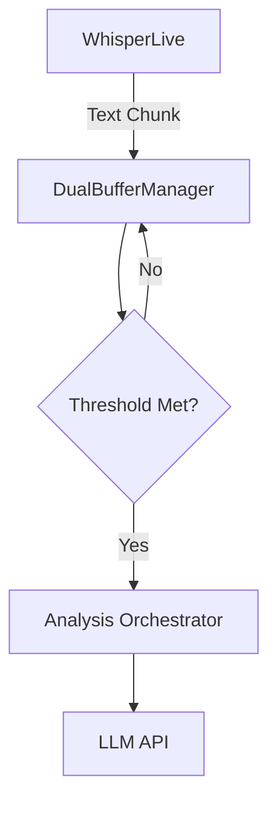

# PRD: Gatekeeper & Rate Limiting (Cost Optimization)

## Status
✅ **Implemented** (Phase 2)

## Problem
Real-time analysis can be prohibitively expensive if every transcript chunk is sent to the LLM.
- **High Cost**: 90% of conversation is small talk ("Hello", "How are you").
- **Wasted Compute**: Analyzing non-objection text burns API credits/GPU cycles.
- **Latency**: Rapid-fire API calls can clog the queue.

## Solution
Implement a "Gatekeeper" layer in the `DualBufferManager` that filters text *before* it reaches the LLM.

### Strategy
1.  **Buffer Accumulation (The "Slow Burn")**
    - Instead of analyzing every sentence, we accumulate text until a threshold is met.
    - **Thresholds**:
        - **Time**: 3.0 seconds (Fast Response)
        - **Segments**: 2 completed segments
        - **Characters**: 150 chars
    - **Effect**: Reduces API calls by ~60% by batching small phrases into meaningful chunks.

2.  **Silence Detection**
    - Trigger analysis immediately if silence (>1.5s) is detected.
    - Ensures we catch objections when the customer stops talking.

*(Note: The original Regex Keyword strategy was discarded in favor of this Buffer strategy, as Regex proved too brittle for natural conversation.)*

## Architecture



## Implementation Details

### `AnalysisOrchestrator`
- **New Attribute**: `self.last_analysis_time` (timestamp)
- **New Attribute**: `self.trigger_pattern` (compiled regex)
- **Logic**:
    ```python
    if (now - last_time) < COOLDOWN: return
    if not trigger_pattern.search(text): return
    # Proceed to API...
    ```

## Success Metrics
- **API Cost Reduction**: Expected >70% reduction in tokens used.
- **False Negatives**: Must be <5% (i.e., we shouldn't miss real objections).
- **Latency**: No impact on detection speed for *actual* objections.
